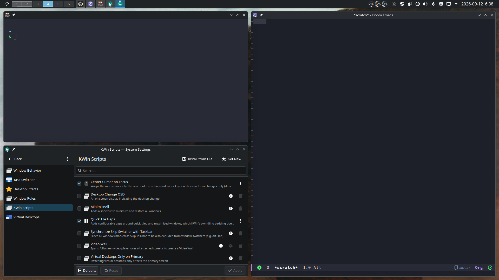
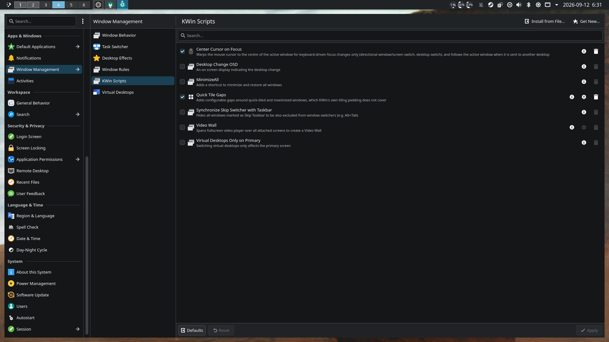

# SPDX-FileCopyrightText: 2026 Tomás Bizet <tbizetde@gmail.com>
# SPDX-License-Identifier: GPL-3.0-or-later

#+title: Quick Tile Gaps

A KWin script that puts gaps around windows placed by Plasma's ordinary quick tiling (=Meta= + arrow keys, dragging a window to a screen edge) and around maximized windows.

Maximized windows get their own gap, which can be turned off on its own.

* Intent

KDE already has native gaps, but only for the custom layouts you draw in the tile editor. The tiling everybody actually uses by default gets nothing.

The reason is not an oversight in the settings UI, it is structural. KWin builds the =QuickRootTile= and each of its eight children with padding hardcoded to zero (=src/tiles/quicktile.cpp=), and the =[Tiling] padding= setting is only ever pushed onto the custom root tile (=src/tiles/tilemanager.cpp=). That is true in every Plasma 6 release so far and on =master=, and there is no open merge request to change it.

So this script gaps the windows KWin will not, and leaves custom layouts alone so their native padding keeps working.

* Configuration

System Settings → Window Management → KWin Scripts → Quick Tile Gaps → configure button.

| Setting                  | Default | What it covers                                                   |
|--------------------------+---------+------------------------------------------------------------------|
| Between tiled windows    |    8 px | Total space between two tiled windows sitting next to each other |
| Around tiled windows     |    8 px | Space between a tiled window and the work area edge              |
| Around maximized windows |    8 px | Space on all four sides of a maximized window, 0 to disable      |

Inner and outer are separate because they are visually different distances. A single value makes the channel between two windows read heavier than the margin at the screen edge, or the other way around, depending on which one you tune for.

#+begin_example
+------------------------------------------------+
|    .----------------.    .----------------.    |
|    |    window A    |    |    window B    |    |
|    '----------------'    '----------------'    |
+------------------------------------------------+
 <-->                  <-->
 outer                 inner
#+end_example

"Between tiled windows" is the *total* gap, so each window gives up half of it on a shared edge. Set it equal to your tile editor padding to make quick tiling and custom layouts look identical; the tile editor uses the same half-on-shared-edges rule.

Settings are stored in =~/.config/kwinrc= under =[Script-quicktilegaps]=, as =InnerGap=, =OuterGap= and =MaximizedGap=, if you would rather keep them in your dotfiles.

* Install

From inside the script directory:

#+begin_src sh
  kpackagetool6 --type KWin/Script --install .
#+end_src

Then enable it in System Settings → Window Management → KWin Scripts.

To update an install you already made:

#+begin_src sh
  kpackagetool6 --type KWin/Script --upgrade .
#+end_src

If you are working on the script, symlinking the source directory into =~/.local/share/kwin/scripts/quicktilegaps= works too. KWin caches scripts, so toggle the script off and on in System Settings after changing the code.

* Requirements

+ Plasma 6.3 or later. =Window.maximizeMode= only became scriptable in 6.3; on 6.0 to 6.2 gaps for tiled windows would work but maximized windows would not be touched.
+ Wayland

* How it works

Every managed window is watched for =tileChanged=, =maximizedChanged= and =frameGeometryChanged=. When one of those fires, the script asks KWin where the window *should* be, which is =tile.absoluteGeometry= for a tiled window or the maximize area for a maximized one, insets that rect, and writes it back.

Two details do most of the work:

+ A window is only gapped when its frame still matches that rect exactly. Once inset it no longer matches, which is what keeps =frameGeometryChanged= from feeding back into itself, and it is also why a window you have resized by hand is left alone.
+ Tile geometry is derived from the same =clientArea(MaximizeArea)= rect the script compares against, so deciding whether an edge touches the work area boundary or a neighbour is an exact test rather than a guess with a pixel tolerance.

Quick tiles are told apart from custom ones by walking up to the topmost tile and comparing it against the tile editor's root for that output and desktop. Anything that is not that root belongs to the =QuickRootTile=, which scripts cannot reach by any other route.

* Differences from similar scripts

The existing gaps scripts predate KWin's tile API and reconstruct window layout themselves, by tracking which shortcut was pressed and computing screen fractions. That is where their bugs live: custom split ratios, multi-monitor setups and resized tiles all drift out of sync, and it takes several hundred lines and a dozen settings to paper over.

This one reads =window.tile= and asks KWin what the layout is, so resized tiles, unusual split ratios, multiple outputs and per-desktop tile layouts are all handled without knowing they exist. It is about 150 lines with three settings.

+ [[https://github.com/nclarius/tile-gaps][nclarius/tile-gaps]] ("Window Gaps") is the popular one, but it still calls =workspace.clientList()= and =clientAdded=, both removed in KWin 6, so it does not run on Plasma 6 at all. Its port issue has been open since March 2024.
+ [[https://github.com/FredworkLemmas/kwin-tile-gaps][Interstitia]] is a maintained Plasma 6 fork of it, ported to the KWin 6 API but still built on the same geometry-guessing approach.
+ Full tiling managers like [[https://github.com/zeroxoneafour/polonium][Polonium]] and [[https://github.com/peterfajdiga/karousel][Karousel]] have gaps, but they replace your window management wholesale. This script changes nothing about how tiling behaves.

* License

GPL-3.0-or-later, see [[file:LICENSES/GPL-3.0-or-later.txt][LICENSES/GPL-3.0-or-later.txt]].
